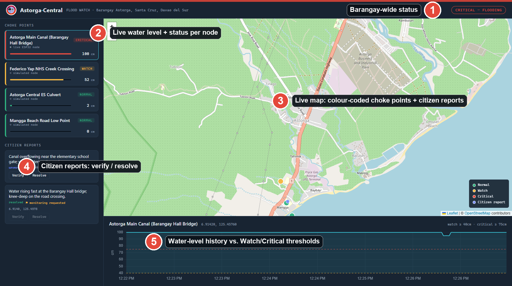
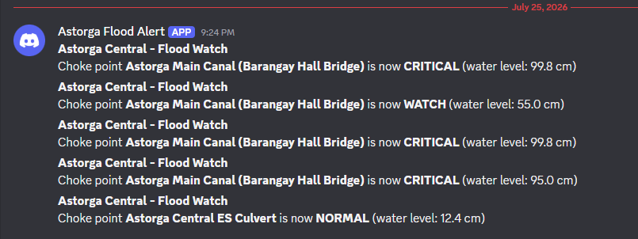
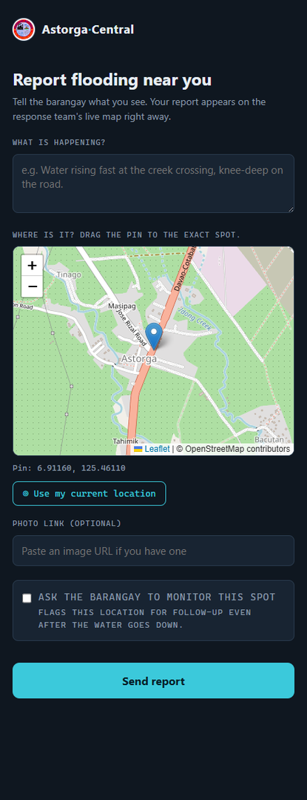

# Astorga Central: Flood Watch

A low-cost flood early-warning system for a Philippine barangay (Barangay Astorga, Santa Cruz, Davao del Sur). Ultrasonic sensors at flood choke points classify the water level as Normal, Watch or Critical and fire instant alerts. Residents report flooding from their phones. Officials act on a live map.

"Astorga Central" is a reusable **barangay platform** and Flood Watch is Module 1. The generic `core/` (citizen reports and the map) is reused by any future service.



## What it does

- **Sensing:** an ESP32 node with a JSN-SR04T waterproof ultrasonic sensor posts distance readings to the API. Three more choke points run as software simulators, so the whole barangay picture shows from the cost of one sensor.
- **Classification:** each reading becomes Normal, Watch or Critical against per-point thresholds. The sensor has a ~20 cm blind zone, so any reading under 20 cm is treated as **Critical** instead of trusted. It errs toward alerting.
- **Alerting:** a change into Watch or Critical fires a Discord webhook message, so the alert channel needs no paid SMS or cloud service. Alerts fire on the change, not on every reading, so a sensor posting every few seconds does not flood the channel.
- **Citizen reports:** a public page with GPS and a draggable pin submits a report. Officials verify or resolve it from the dashboard.
- **Operations board:** a Leaflet map with colour-coded choke points and reports, a barangay-wide status ribbon, and a water-level history chart against the Watch and Critical thresholds.

| Alert in Discord | Citizen report page |
|---|---|
|  |  |

## What's in here

| Path | What it is |
|---|---|
| `backend/` | FastAPI + SQLite API (choke points, readings, reports, map) and a background simulator |
| `dashboard/` | Officials' live operations board (Leaflet map, status ribbon, history charts) |
| `report-form/` | Public citizen report page (GPS + draggable pin) |
| `firmware/` | ESP32 and ESP8266 sensor sketches, plus a script that posts a test reading |
| `docs/` | `budget.md`, architecture figures, screenshots and the pitch outline |
| `index.html` | Public landing page for the platform |
| `run_demo.ps1` | Starts the backend and pages for a demo (PowerShell) |

## Architecture

```
  Real ESP32 node ─┐                          ┌─ Dashboard (officials)
  (ultrasonic)     ├─► POST /api/flood/readings│   live map + status + history
  Simulator (x3) ──┘        │                  │
                            ▼                  ├─ Report form (citizens)
                     FastAPI + SQLite ─────────┤   GPS + pinned reports
                            │                  │
                            └─► Discord webhook ┘ (live alert channel)
```

- **Free stack:** OpenStreetMap/CARTO tiles, a Discord webhook, and one small server. No paid map or cloud API.
- **Module boundary:** `backend/core/` holds citizen reports and the map. `backend/modules/flood_watch/` holds choke points, ingestion, the simulator and alerts, so a second service can reuse `core/` without touching flood code.
- **Regenerable demo data:** the database is not committed. `seed.py` recreates the choke points and is idempotent.
- **Field provisioning:** the firmware boots into a captive-portal access point when it has no working Wi-Fi. A phone picks the site network and the backend address, and the values are saved to flash.

## Run it locally (demo)

Requires Python 3.12+ (tested on 3.14). From `backend/`:

```bash
py -m venv venv
venv/Scripts/python -m pip install -r requirements.txt   # Windows
# source venv/bin/activate && pip install -r requirements.txt   # macOS/Linux

# start the API (also launches the choke-point simulator)
venv/Scripts/python -m uvicorn main:app --port 8000

# in a second terminal, seed the choke points (idempotent)
venv/Scripts/python seed.py
```

Serve the two static pages from the project root so both are reachable:

```bash
py -m http.server 5500
```

- Dashboard: http://localhost:5500/dashboard/
- Report form: http://localhost:5500/report-form/

> Serve over `http://localhost` (not `file://`) so the report form's GPS button works. Geolocation needs a secure context.

### Discord alerts (optional)

```bash
# set before starting uvicorn
export DISCORD_WEBHOOK_URL="https://discord.com/api/webhooks/..."   # bash
$env:DISCORD_WEBHOOK_URL="https://discord.com/api/webhooks/..."     # PowerShell
```

Without it, alerts are skipped silently. `run_demo.ps1` also reads the webhook from a gitignored `.env.local`.

### Trigger a Critical status by hand (no hardware needed)

```bash
curl -X POST http://localhost:8000/api/flood/readings \
  -H "Content-Type: application/json" \
  -d '{"choke_point_id":1,"distance_cm":30}'
```

## Hardware node

See `firmware/flood_sensor/flood_sensor.ino` (ESP32) or `firmware/flood_sensor_esp8266/` (ESP8266). The JSN-SR04T Echo pin goes through a voltage divider (5V to 3.3V). Set `CHOKE_POINT_ID=1` (the live node seeded by `seed.py`). Change the default `AP_PASSWORD` before flashing.

## API summary

| Method | Path | Purpose |
|---|---|---|
| GET | `/api/health` | Liveness |
| GET | `/api/map` | All map pins (choke points and reports) |
| GET/POST | `/api/flood/choke-points` | List / create choke points |
| GET | `/api/flood/choke-points/{id}/history` | Water-level readings |
| POST | `/api/flood/readings` | Ingest a sensor reading (ESP32 or manual) |
| GET/POST | `/api/reports` | List / submit citizen reports |
| PATCH | `/api/reports/{id}/verify` and `/resolve` | Official actions |

## What this demonstrates

- An end-to-end path from a physical sensor to an API, a database, a live map and an alert channel.
- A fail-safe design choice, where an untrustworthy reading raises the alarm instead of hiding.
- Event-driven alerting through a webhook, with no paid infrastructure.
- Splitting a generic core from a feature module so the platform can grow.
- A seed script and simulator that make the whole system demoable with one real sensor.

## Production hardening (out of scope for the demo)

- Lock down CORS (currently open `*` for the file-served demo).
- Add Subresource Integrity (`integrity=...`) to the CDN `<script>` tags.
- Move alerts to an SMS gateway for residents without Discord.
- Solar, battery and an IP65 enclosure per field node (see `docs/budget.md`).
