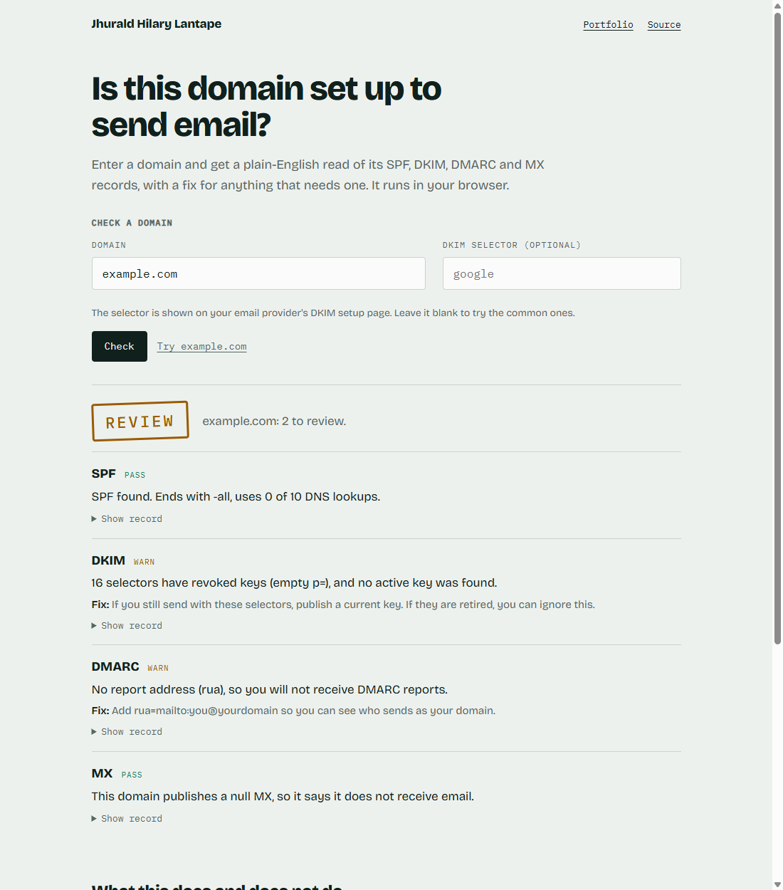

# Proj17: Email Deliverability Checker

A page that reads a domain's SPF, DKIM, DMARC and MX records from your browser and says, in plain sentences, what is wrong and how to fix it. Try it: [ainz47.github.io/Projects/deliverability/](https://ainz47.github.io/Projects/deliverability/).



## What it checks
- **SPF.** A record exists and there is only one. It ends in `-all` or `~all` (`+all` fails, `?all` or no ending warns). It follows `include:` and `redirect=` chains and counts DNS lookups against the limit of 10, so a record that receivers would reject shows as a fail. An include that loops or points at nothing fails.
- **DMARC.** A record exists, has a valid policy, and is enforcing (`p=none` warns because it only monitors). It warns when there is no report address or `pct` is under 100. A subdomain with no record uses its parent's and says so.
- **DKIM.** It tries about 16 common selectors (google, selector1, selector2, default, k1 to k3, s1, s2 and others) plus one you type in. Empty keys, keys that look 1024-bit and test mode (`t=y`) warn. A selector you typed that has no record fails. Finding nothing among the common ones only warns, because a selector cannot be discovered from a domain.
- **MX.** Mail servers exist. A null MX (a domain that says it takes no mail) passes with a note.

Each row shows pass, warn or fail, one plain sentence, a fix line, and the raw record. The stamp at the top is **Ready**, **Review**, **Fix first**, or **Couldn't finish**.

A lookup that fails (network, resolver) is its own result, "could not check". It is never read as "the domain has no SPF", and the stamp says **Couldn't finish** instead of Ready.

## What is verified
Checked automatically on every push (GitHub Actions, Windows runner): unit tests (`node --test`) for every check, the DNS client and the verdict, run against fake DNS answers, so they are offline and repeatable. Other tests check that the page on disk is exactly what the generator builds from the tested code, that the page never writes HTML from strings, and that the merged script runs in a bare context and produces a verdict.

Checked by hand, in a real browser against live DNS-over-HTTPS: `example.com`, `gmail.com` (pasted as a URL with `www.`), a made-up domain that does not exist, an IP address and a bad selector (both refused before any lookup), and a simulated network outage. The first live runs turned up four faults that the fake-DNS tests had missed, all now fixed and covered by tests: an RFC-reserved domain that publishes revoked keys was reported as a failure, the same fix line repeated once per probed selector, pasting a `www.` URL checked the wrong host, and a lookup-failure message had doubled brackets.

Not done: nothing is deployed beyond the static page, and no other real domains were tried, so treat results on unusual setups as unproven.

## Known limits
- DNS only. It does not check blacklists or inbox placement and cannot test that a real message passes. A clean result does not guarantee inbox placement.
- A DKIM selector cannot be discovered from a domain. If yours is unusual, type it in.
- There is no public-suffix list. The DMARC parent search stops at two labels, which costs an extra harmless lookup on names like `example.co.uk`.
- SPF is counted by lookups only: it does not evaluate the "void lookup" limit, and it counts `a` and `mx` without resolving them.
- The domain you type goes to Cloudflare's public DNS-over-HTTPS service (Google's if Cloudflare fails). Nothing goes to me and nothing is stored.

## How it is built
```
code/*.js      plain ES modules: domain, dns, spf, dkim, dmarc, mx, report (+ result, tags helpers)
tests/*.test.js  node --test, fake DNS
tools/build_page.mjs + page.template.html  ->  ../docs/deliverability/index.html
```
Only `dns.js` touches the network; every check takes an injected `resolve(name, type)`, which is why the tests need no network. GitHub Pages serves only `/docs`, so the live page is generated into `docs/deliverability/` from the tested modules rather than written by hand. The generator accepts only the simple import and export forms the modules use and stops with an error on anything else. The DNS client tries Cloudflare then Google, times out after 5 seconds, caches within a run, and stops at 60 requests so a hostile SPF chain cannot make the page fire hundreds.

DNS answers are text an attacker controls, so the page writes them with `textContent` only. A test fails if the page ever uses `innerHTML` or similar.

## Run and rebuild
```
cd Proj17_Email_Deliverability_Checker
node --test "tests/*.test.js"      # run on Node 24
node tools/build_page.mjs          # regenerate docs/deliverability/index.html
```
Do not hand-edit the generated page. Edit `code/*.js` or `tools/page.template.html`, rebuild, and the sync test will pass.
