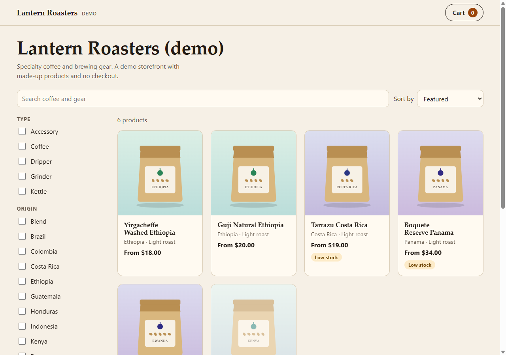
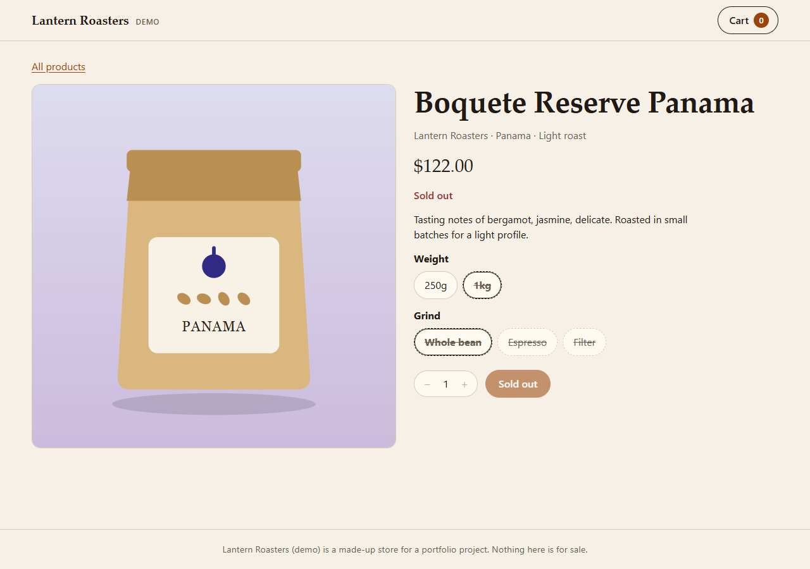

# Proj18: Lantern Roasters (demo), a dynamic coffee storefront

A storefront for a made-up coffee shop, built to show the parts of a real store that take care: search and filters you can share as a link, options such as weight and grind that change the price and stock, and a cart that survives a reload. Try it: [ainz47.github.io/Projects/coffee-store/](https://ainz47.github.io/Projects/coffee-store/).



The products are made up, there is no checkout, and nothing is sold.

## What it does
- **Listing.** Search over title, tags, vendor, type, origin and roast (every word must match), filters for type, origin, roast, in stock and price, and four sort orders. All of it lives in the URL hash, so a filtered view is a link you can send. Under "Featured", sold-out products sort last. The result count is announced to screen readers.
- **Product page.** Options such as weight and grind choose a variant, and the price and stock update for each combination. Values with no stock are marked and struck through but stay selectable, so nobody is stuck; choosing a sold-out combination says "Sold out" and turns Add off. Stock of 5 or fewer is labelled.
- **Cart.** A drawer with quantity steppers capped at stock, a subtotal and a free-shipping bar. It is saved in the browser. On load, any line whose variant no longer exists is dropped and quantities are clamped to stock. Checkout is a disabled demo button.
- **When things go wrong.** A catalog that fails to load, or has no valid products, shows a screen that says why. An unknown product link shows a not-found page. Blocked or corrupt browser storage means an empty cart and a note, not a broken page.



## What is verified
Checked automatically (vitest, and on every push in GitHub Actions on a Windows runner): the product normalizer, which rejects a bad product with a reason instead of guessing; search, filters, sorting and the URL round trip; variant selection; the cart reducer, stock clamping and tolerant storage; the generated art (well-formed, deterministic, no external references); the whole app driven through its rendered pages and drawer in jsdom; the exporter against fake API responses (pagination, throttling, retries, missing credentials, no token in output); the stylesheet rules (transform and opacity only, nothing over 300ms, reduced motion honoured); the type check; a size budget on the built JavaScript; a check that the page makes no request to another origin; and a check that the committed page is exactly what the source builds.

Checked by hand in a real browser (Chromium via Playwright), against the built page: search/filter/sort by URL with correct back-button and reload behaviour, the sold-out variant styling, adding to cart with focus moving correctly on open/close/Escape, cart persistence across a reload, a full keyboard-only pass with visible focus rings, no horizontal overflow at 390px width, `prefers-reduced-motion` actually swapping the animation used, a blocked-storage fallback that degrades to an in-memory cart with a visible note instead of breaking, an unknown-product route showing the not-found page, and that every network request stays on the same origin. Also reviewed against a design/accessibility guideline checklist and a UI-pattern detector, twice (before and after adding the front-page hero). Full results, including two items intentionally left as-is with reasons: `AUDIT.md`.

Not done, and not claimed: any Shopify integration or live store (see below), a checkout, payments, accounts, a backend, or that the products exist.

## Using data from a real Shopify store
`data/catalog.fixture.json` has the same shape as the `products` query in `exporter/client.mjs` (Admin GraphQL API version 2026-07). To try a real store, create an app in the Shopify Dev Dashboard with read access to products, install it on a development store, then in a Bash shell:

    SHOPIFY_SHOP=your-store SHOPIFY_CLIENT_ID=your-client-id SHOPIFY_CLIENT_SECRET=your-client-secret npm run export

That writes `data/catalog.export.json`. To show it, change the one import in `src/data/source.ts`. The `custom.origin` and `custom.roast` metafields feed the origin and roast filters; without them those filters are empty.

The exporter has only ever run against fake API responses. It has not been run against a real store, and the token request in `exporter/auth.mjs` is my reading of Shopify's client credentials grant, so the first live run may need a fix there. The exporter never prints or writes the token.

## Known limits
- The catalog is a fixture: 30 made-up products, prices in US dollars.
- The cart is per browser. It is not synced across tabs or devices.
- Routing uses the URL hash, because GitHub Pages cannot rewrite paths.
- Product art is generated SVG, not photography.

## How it is built
```
data/catalog.fixture.json     Shopify-shaped products, made by tools/make_fixture.mjs
exporter/                     Admin GraphQL client (auth, pagination, throttling, retries)
src/model/                    the Product type and the GraphQL normalizer
src/lib/                      search and filters, variants, cart, money: plain tested functions
src/art/                      generated SVG for bags, drippers, kettles and grinders
src/ui/                       React components that only render the modules above
src/data/source.ts            the one place that decides fixture or export
```
The logic lives in plain modules and the components only render it, which is why most of the tests need no browser. Product art is shown through `` and never injected as HTML, and a test fails if the source ever writes HTML from a string. Nothing loads from another origin: no CDN, no web fonts, no analytics.

## Run and rebuild
```
cd Proj18_Coffee_Storefront
npm ci
npm test               # Node 24
npm run typecheck
npm run dev            # http://localhost:5173/Projects/coffee-store/
npm run build          # writes ../docs/coffee-store, which GitHub Pages serves
npm run fixture        # regenerate data/catalog.fixture.json
```
Do not hand-edit `docs/coffee-store/`. Change the source, rebuild, and commit the result; CI fails if the committed page differs from what the source builds.
