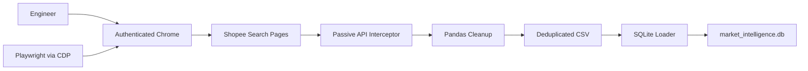

# Proj2 Architecture Diagram

This diagram reflects the current implementation in `Proj2_ShopeeHijacker`.

## Data Flow

1. The engineer opens Chrome in remote debugging mode and signs into Shopee manually.
2. Playwright connects to that live browser through the Chrome DevTools Protocol.
3. The script visits Shopee search result pages and listens for backend search API responses.
4. Raw JSON product data is captured passively instead of replaying requests directly.
5. Pandas deduplicates product rows and writes the result to CSV.
6. A second script optionally loads the CSV into `market_intelligence.db` for analysis.
