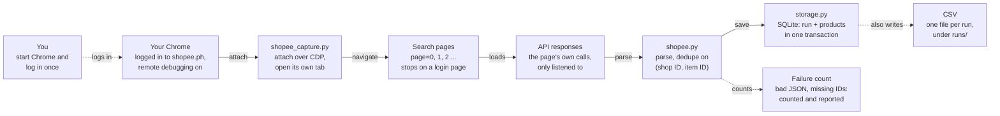

# Shopee Search Capture: architecture

Search results read from the page's own API responses in your logged-in Chrome, kept per run in SQLite.

```mermaid
flowchart LR
    m0["Your Chrome<br/>logged in to shopee.ph,<br/>remote debugging on"]
    m1["shopee_capture.py<br/>attach over CDP,<br/>open its own tab"]
    m2["Search pages<br/>page=0, 1, 2 ...<br/>stops on a login page"]
    m3["API responses<br/>the page's own calls,<br/>only listened to"]
    m4["shopee.py<br/>parse, dedupe on<br/>(shop ID, item ID)"]
    m5["storage.py<br/>SQLite: run + products<br/>in one transaction"]
    m0 -- attach --> m1
    m1 -- navigate --> m2
    m2 -- loads --> m3
    m3 -- parse --> m4
    m4 -- save --> m5
    s0["You<br/>start Chrome and<br/>log in once"]
    s0 -. logs in .-> m0
    s1["Failure count<br/>bad JSON, missing IDs:<br/>counted and reported"]
    m4 -. counts .-> s1
    s2["CSV<br/>one file per run,<br/>under runs/"]
    m5 -. also writes .-> s2
```

- **No scripted requests:** it reads the traffic the page makes anyway, in its own tab, and never touches your other tabs.
- **History:** runs are appended, never replaced, so an item's price and sales can be compared across days.

Also as [SVG](./architecture-diagram.svg) and [PNG](./architecture-diagram.png).
