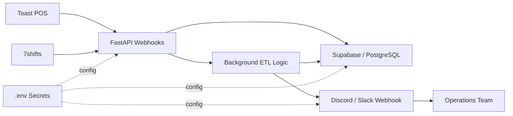

# Proj7 Architecture Diagram

This diagram reflects the current implementation in `Proj7_FastAPI_ETL_Alerts`.

## Data Flow

1. Toast POS sends sales payloads to the FastAPI sales webhook.
2. 7shifts sends labor payloads to the FastAPI labor webhook.
3. FastAPI validates the payloads and upserts daily records into Supabase.
4. A background task checks whether both sales and labor data exist for the same store and date.
5. The transformation layer calculates CPLH and labor percentage.
6. The service updates the database with the computed metrics.
7. If labor percentage exceeds the profitability threshold, the notifier sends a Discord or Slack alert.
