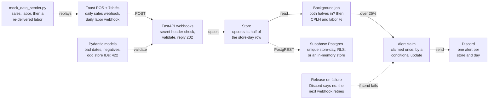

# Restaurant Labor Alerts: architecture

POS and scheduler webhooks joined per store-day, labor metrics stored, one Discord alert over 25%.

```mermaid
flowchart LR
    m0["Toast POS + 7shifts<br/>daily sales webhook,<br/>daily labor webhook"]
    m1["FastAPI webhooks<br/>secret header check,<br/>validate, reply 202"]
    m2["Store<br/>upserts its half of<br/>the store-day row"]
    m3["Background job<br/>both halves in? then<br/>CPLH and labor %"]
    m4["Alert claim<br/>claimed once, by a<br/>conditional update"]
    m5["Discord<br/>one alert per<br/>store and day"]
    m0 -- POST --> m1
    m1 -- upsert --> m2
    m2 -- read --> m3
    m3 -- over 25% --> m4
    m4 -- send --> m5
    s0["mock_data_sender.py<br/>sales, labor, then a<br/>re-delivered labor"]
    s0 -. replays .-> m0
    s1["Pydantic models<br/>bad dates, negatives,<br/>odd store IDs: 422"]
    s1 -. validate .-> m1
    s2["Supabase Postgres<br/>unique store-day, RLS;<br/>or an in-memory store"]
    m2 -. PostgREST .-> s2
    s3["Release on failure<br/>Discord says no: the<br/>next webhook retries"]
    s3 -. if send fails .-> m4
```

- **Safe on re-delivery:** every write is an atomic upsert, and a re-sent webhook recomputes but never alerts twice.
- **Verified 2026-09-27:** local run with the real Discord webhook: waiting, alerted, then already_alerted on re-delivery.
- **Secrets:** WEBHOOK_SECRET, SUPABASE_URL + service-role key, ALERT_WEBHOOK_URL (.env).

Also as [SVG](./architecture-diagram.svg) and [PNG](./architecture-diagram.png).
