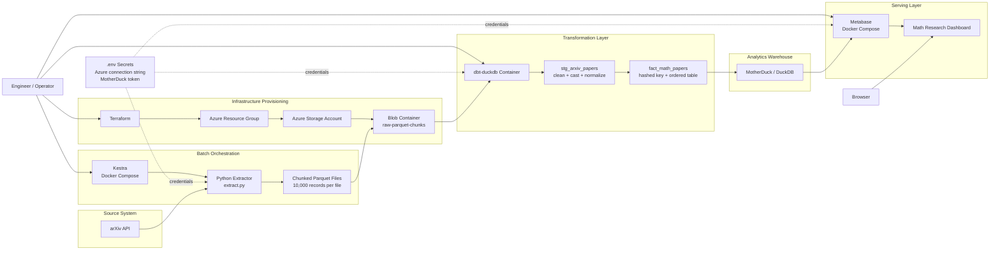

# Proj8 Architecture Diagram

This diagram reflects the current implementation in `Proj8_Arxiv_Pipeline`.

## Data Flow

1. Terraform provisions the Azure resource group, storage account, and the `raw-parquet-chunks` container.
2. Kestra runs the Python extraction job against the arXiv API.
3. The extractor paginates results, writes parquet chunks locally, and uploads them into Azure Blob Storage under `raw/`.
4. dbt reads the raw parquet files directly from Azure, creates the staging model, and materializes the curated fact table in MotherDuck.
5. Metabase connects to MotherDuck and serves the dashboard to the browser.

## Main Components

- `infrastructure/`: Terraform for Azure storage resources.
- `orchestration/`: Kestra runtime launched with Docker Compose.
- `extraction/`: Python batch extractor with Azure Blob upload support.
- `transformation/`: dbt project using DuckDB + MotherDuck.
- `visualization/`: Metabase service for dashboarding.
