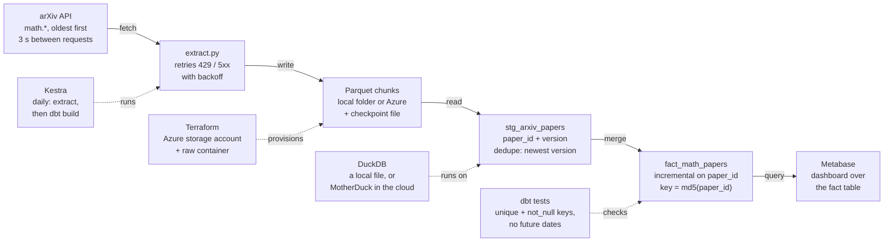

# arXiv Pipeline: architecture

Resumable batch extraction into Parquet, incremental dbt models on DuckDB, run daily by Kestra.

```mermaid
flowchart LR
    m0["arXiv API<br/>math.*, oldest first<br/>3 s between requests"]
    m1["extract.py<br/>retries 429 / 5xx<br/>with backoff"]
    m2["Parquet chunks<br/>local folder or Azure<br/>+ checkpoint file"]
    m3["stg_arxiv_papers<br/>paper_id + version<br/>dedupe: newest version"]
    m4["fact_math_papers<br/>incremental on paper_id<br/>key = md5(paper_id)"]
    m5["Metabase<br/>dashboard over<br/>the fact table"]
    m0 -- fetch --> m1
    m1 -- write --> m2
    m2 -- read --> m3
    m3 -- merge --> m4
    m4 -- query --> m5
    s0["Kestra<br/>daily: extract,<br/>then dbt build"]
    s0 -. runs .-> m1
    s1["Terraform<br/>Azure storage account<br/>+ raw container"]
    s1 -. provisions .-> m2
    s2["DuckDB<br/>a local file, or<br/>MotherDuck in the cloud"]
    s2 -. runs on .-> m3
    s3["dbt tests<br/>unique + not_null keys,<br/>no future dates"]
    s3 -. checks .-> m4
```

- **Resumes:** the checkpoint sits next to the chunks, so a restarted run or a fresh container picks up at the last chunk.
- **Verified 2026-09-27:** 2,000 real papers in two resumed runs, both dbt builds 11/11, the second load incremental.
- **Secrets:** AZURE_CONNECTION_STRING and MOTHERDUCK_TOKEN, from Kestra's secret store.

Also as [SVG](./architecture-diagram.svg) and [PNG](./architecture-diagram.png).
