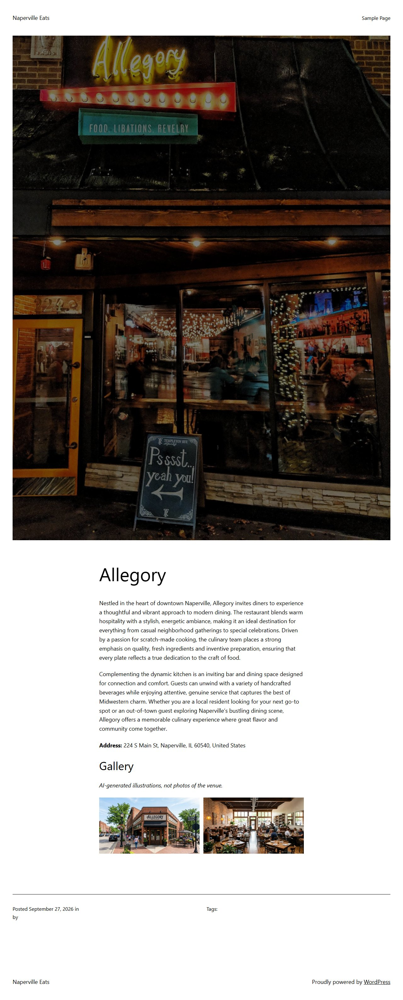

# Directory ETL Pipeline (Google Maps -> Gemini -> WordPress)

Give it a list of businesses and it builds a local directory site: it finds each one on Google Maps with Playwright, has Gemini write the listing and vet the photo, and saves the result to WordPress as a `directory_listing` post. Run it again and it updates the same posts instead of creating duplicates.

Architecture diagram: [docs/architecture-diagram.md](./docs/architecture-diagram.md) | [docs/architecture-diagram.svg](./docs/architecture-diagram.svg) | [docs/architecture-diagram.png](./docs/architecture-diagram.png)



## Live run against a real WordPress site

Run on 2026-09-27 against a fresh WordPress install ("Naperville Eats", a temporary TasteWP site) with the plugin in `wp-plugin/` active, over three Naperville businesses from `businesses.json`. The reports are committed as they came out of the pipeline.

**Run 1** ([runs/live_run_1.jsonl](./runs/live_run_1.jsonl)): every business created, Gemini wrote every story, every scraped photo passed the gates and was uploaded, and two AI gallery images were generated per listing.

```
{"business": "Allegory", "status": "created", "post_id": 11, "ai_story": true, "image": "uploaded", "gallery": 2}
{"business": "Quigley's Irish Pub", "status": "created", "post_id": 15, "ai_story": true, "image": "uploaded", "gallery": 2}
{"business": "Empire Burgers + Brew", "status": "created", "post_id": 19, "ai_story": true, "image": "uploaded", "gallery": 2}
```

**Run 2** ([runs/live_run_2.jsonl](./runs/live_run_2.jsonl)), same input: the same three posts updated, photos reused instead of uploaded again, no new gallery images, and the site's REST API still lists exactly three listings.

```
{"business": "Allegory", "status": "updated", "post_id": 11, "ai_story": true, "image": "reused", "gallery": 0}
{"business": "Quigley's Irish Pub", "status": "updated", "post_id": 15, "ai_story": true, "image": "reused", "gallery": 0}
{"business": "Empire Burgers + Brew", "status": "updated", "post_id": 19, "ai_story": true, "image": "reused", "gallery": 0}
```

Screenshots: [a listing page](./docs/screenshots/listing_allegory.jpg), [another](./docs/screenshots/listing_quigleys.jpg), [the /listings/ archive](./docs/screenshots/listings_archive.jpg).

The gallery images depict real businesses but are generated, so the listing page labels them "AI-generated illustrations, not photos of the venue". The main photo on each listing is the real one scraped from Google Maps.

## How it works

For each business in the input file:

1. **Scrape** (`scraper.py`): Playwright searches Google Maps and reads the name, address and cover photo. The photo is requested at 1600px wide.
2. **Write** (`pipeline_processor.py`): Gemini writes a two-paragraph listing, told not to invent prices, awards, hours or menu items. The Maps icon glyphs are stripped from the text, and `place_id = md5(name + address)` becomes the listing's identity.
3. **Look up** (`wp_importer.py`): one `GET ?place_id=` against WordPress decides create or update.
4. **Vet the photo** (`transformations.py`, new listings only): Gemini Vision rejects menus, crowds, parking lots and food close-ups; a photo under 1200px wide is regenerated from a prompt. On an update the existing featured image is reused, so nothing is re-downloaded or re-uploaded.
5. **Gallery** (`image_generator.py`, optional `--gallery`, new listings only): an exterior and an interior image from Gemini's image model.
6. **Save**: one create or update per business, with the featured image, the gallery and the meta fields in the same request.

One business failing (not found, an API error) is recorded in the report and the batch carries on. Every Gemini and WordPress call has a timeout, so a stalled request can't hang the run.

**The WordPress side** (`wp-plugin/proj9-directory-listing/`) registers the `directory_listing` post type at `/listings/`, the meta fields the pipeline writes, and the `?place_id=` REST filter that makes re-runs idempotent (an exact match on that one key, validated as an md5). On the public page it adds the address and the labelled gallery under the story.

## Fallbacks

| If this fails | What happens | Visible in the report as |
|---|---|---|
| Gemini story | A plain one-line description is used | `"ai_story": false` |
| Photo download, or the relevance check says no | The listing is saved without a featured image | `"image": "none"` |
| Relevance check errors out | The photo is kept rather than lost | (no change) |
| Regenerating a small photo | The original photo is used | `"image": "uploaded"` |
| A gallery image | That image is skipped | `"gallery"` below 2 |
| Business not on Maps, or any other error | Nothing is written for it, the batch continues | `"status": "not_found"` / `"error"` |

Low-res "enhancement" is regeneration from a text prompt, not upscaling of the original pixels. The live run didn't exercise it: all three scraped photos were at least 1200px wide.

## Running it

```bash
pip install -r requirements.txt
playwright install chromium
```

`.env` in this folder (see `.env.example`):

```env
GEMINI_API_KEY=...
WP_BASE_URL=https://your-site.example/wp-json
WP_USERNAME=your-wp-user
WP_APP_PASSWORD=an-application-password
# optional model overrides
GEMINI_TEXT_MODEL=gemini-flash-latest
GEMINI_IMAGE_MODEL=gemini-3.1-flash-image
```

**Against a real WordPress site:** zip `wp-plugin/proj9-directory-listing`, upload and activate it (Plugins > Add New > Upload Plugin), create an application password under Users > Profile, then:

```bash
python run_pipeline.py --input businesses.json --gallery --report runs/my_run.jsonl
```

**Without WordPress:** `mock_wp.py` is an in-memory stand-in for the same endpoints, including the `?place_id=` lookup.

```bash
python -m uvicorn mock_wp:app   # WP_BASE_URL=http://127.0.0.1:8000, WP_USERNAME=mock_admin, WP_APP_PASSWORD=mock_password
python run_pipeline.py --input businesses.json
```

**Tests** (no network, no API key; they run in CI):

```bash
python -m pytest tests -q
```

They cover the listing builder and text cleanup, every fallback above, the photo gates, create-then-update against the mock (one post per business, photo reused, gallery kept), the batch carrying on past a failure, and that the plugin registers every meta key the pipeline writes.

## Repository structure

- `run_pipeline.py`: batch orchestrator and CLI, writes the JSONL report line by line.
- `scraper.py`: Playwright extraction from Google Maps.
- `pipeline_processor.py`: text cleanup, `place_id`, the Gemini story, the listing payload.
- `transformations.py`: photo relevance (Gemini Vision) and resolution gates.
- `image_generator.py`: gallery images and small-photo regeneration.
- `gemini.py`: one lazily created Gemini client with a timeout, and the model names.
- `wp_importer.py`: `WordPressClient` (lookup, media upload, create or update), every response checked.
- `mock_wp.py`: FastAPI stand-in for WordPress.
- `wp-plugin/`: the WordPress plugin.
- `businesses.json`: the input used for the live run.
- `check_models.py`: lists the Gemini models the configured key can use.
