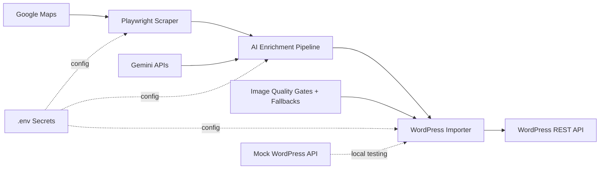

# Proj9 Architecture Diagram

This diagram reflects the current implementation in `Proj9_GeoData_AI_Ingestion_Engine`.

## Data Flow

1. The scraper uses Playwright to collect business metadata and the cover image from Google Maps.
2. The enrichment layer generates a business story, computes a deterministic `place_id`, and prepares the final JSON payload.
3. Image quality checks validate relevance and resolution before upload.
4. If enhancement or generation fails, the pipeline falls back to original or placeholder assets so execution continues.
5. The WordPress importer uploads media, maps gallery items to media IDs, and creates or updates the listing through the REST API.
6. A local FastAPI mock server can replace the real WordPress target during testing.
