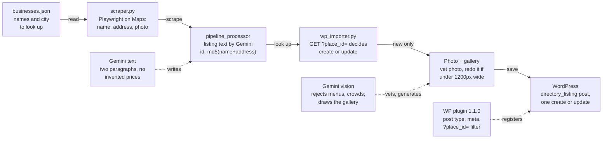

# Directory ETL Pipeline: architecture

Businesses found on Google Maps, written up by Gemini, saved to WordPress, updated in place on every re-run.

```mermaid
flowchart LR
    m0["businesses.json<br/>names and city<br/>to look up"]
    m1["scraper.py<br/>Playwright on Maps:<br/>name, address, photo"]
    m2["pipeline_processor<br/>listing text by Gemini<br/>id: md5(name+address)"]
    m3["wp_importer.py<br/>GET ?place_id= decides<br/>create or update"]
    m4["Photo + gallery<br/>vet photo, redo it if<br/>under 1200px wide"]
    m5["WordPress<br/>directory_listing post,<br/>one create or update"]
    m0 -- read --> m1
    m1 -- scrape --> m2
    m2 -- look up --> m3
    m3 -- new only --> m4
    m4 -- save --> m5
    s0["Gemini text<br/>two paragraphs, no<br/>invented prices"]
    s0 -. writes .-> m2
    s1["Gemini vision<br/>rejects menus, crowds;<br/>draws the gallery"]
    s1 -. vets, generates .-> m4
    s2["WP plugin 1.1.0<br/>post type, meta,<br/>?place_id= filter"]
    s2 -. registers .-> m5
```

- **Idempotent:** a re-run finds each listing by place_id and updates it, reusing the photo instead of uploading it again.
- **Verified 2026-09-27:** live WordPress site, run 1 created 3 listings, run 2 updated the same 3, still exactly 3.
- **Resilient:** one business failing is recorded in the report and the batch carries on; every call has a timeout.

Also as [SVG](./architecture-diagram.svg) and [PNG](./architecture-diagram.png).
